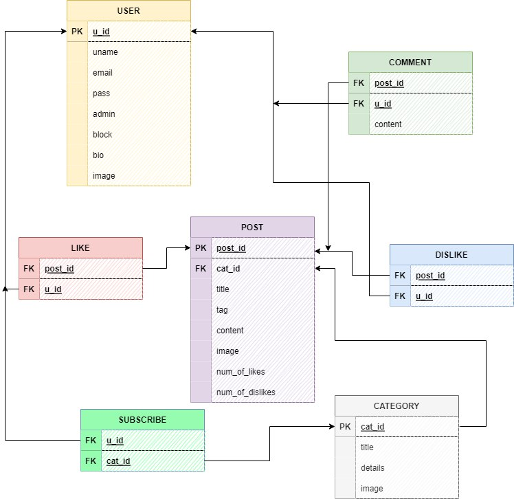

# Blog Project
## database design
   
## video about how it is work
   https://drive.google.com/file/d/1Wkmi-5AovrGN_7xkjDOLwhtrY02Is-m4/view?usp=drivesdk

## Technologies and languages used
   - Django
   - Posrgres
   - python
   - HTML
   - CSS
   - JavaScript
   - jQuery

## Functionalities
   - Authentication
   - Admin panal
     - CRUD on
       - posts
       - users
       - categories
   - add posts
   - like and dislike
   - add comment
   - block user by admin 
   - replace forbidden words
   - search by
     - tag
     - title
   - pagenation
   - subscribe categories
   - show posts of the category
   - send mail to user if he/she was blocked or he/she subscribed category

## Frontend components
   - sidebar (contains categories)
   - navigation bar
   - footer
   - posts 
   - comments
   - login and register
   - profile
   - control panel

## more info
   - This project is made during 7 days
   - It is a final project at ITI

## Done by
   - <a href="https://www.linkedin.com/in/ahmed-ghoniem-6a8623246">Ahmed Ghonim</a>
   - <a href="https://www.linkedin.com/in/amera-mohammed-b07b68238/">Amera mohamed</a>
   - <a href="https://www.linkedin.com/in/khaled-ahmed0/">Khaled Ahmed</a>
   - <a href="https://www.linkedin.com/in/mohamed-kamal-elsharkawy-6184b41a7">Mohammed Kamal</a>
   - Menna Alaktaa

